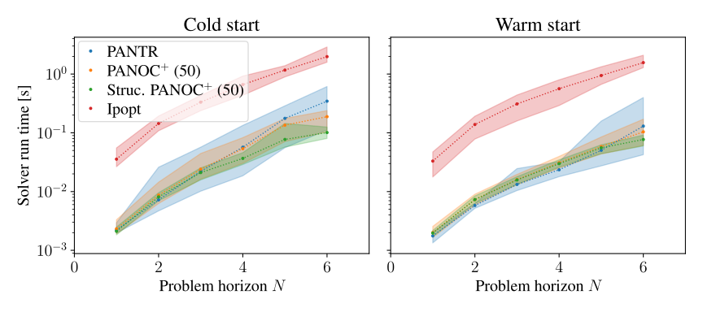
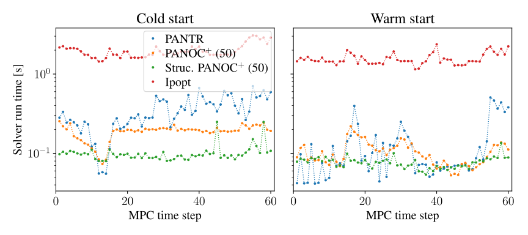
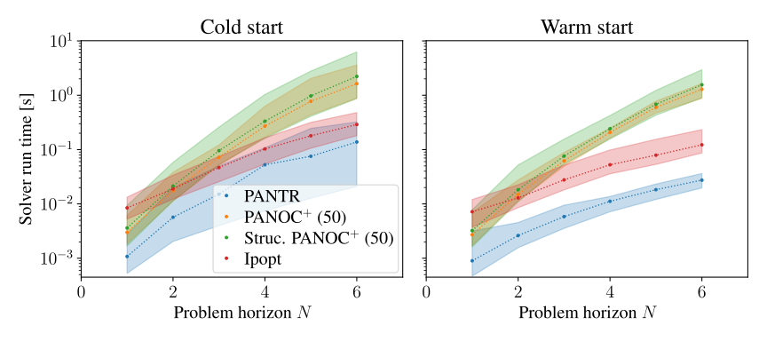
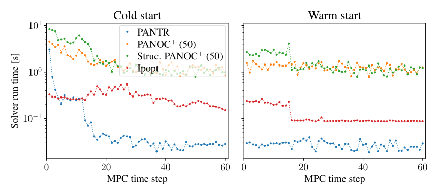
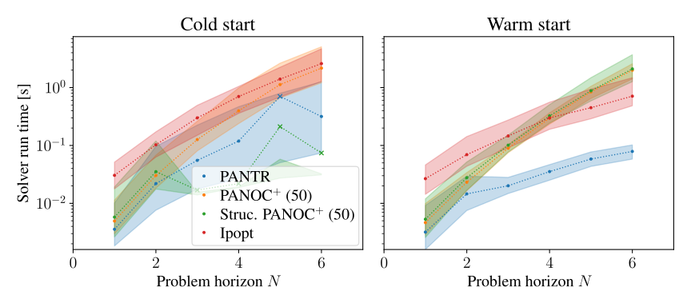
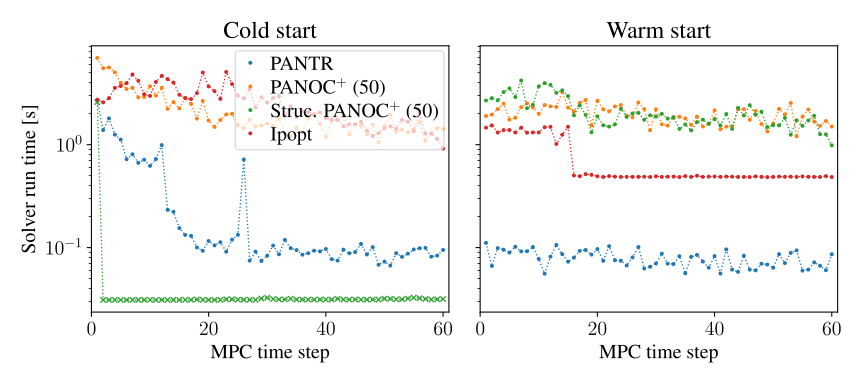

# PANTR: A proximal algorithm with regularized Newton updates for nonconvex constrained optimization

This repository contains a set of benchmarks, including the ones used in the L-CSS/CDC submission of the PANTR method.

### PANTR source code

The source code of PANTR is available on the `develop` branch of the alpaqa repository, at <https://github.com/kul-optec/alpaqa/tree/develop>.

### Instructions (Linux only)

```sh
# Install alpaqa and dependencies, initialize virtual environment
./scripts/get-dependencies.sh
# Generate and compile the benchmark problems and the benchmark driver
./scripts/build-benchmarks.sh
# Activate the virtual environment
. ./.venv/bin/activate
# Run the benchmarks and export the figures
cd new-benchmarks-paper; doit -n$(($(nproc) / 2))
```

---

## Results

### Hanging chain

🚧 (in progress) 🚧

**Average solver run times for different MPC horizons**  


**Average solver run times for horizon 60**  


### Simplified quadcopter

🚧 (in progress) 🚧

**Average solver run times for different MPC horizons**  


**Average solver run times for horizon 60**  


### Quadcopter

🚧 (in progress) 🚧

**Average solver run times for different MPC horizons**  


**Average solver run times for horizon 60**  

